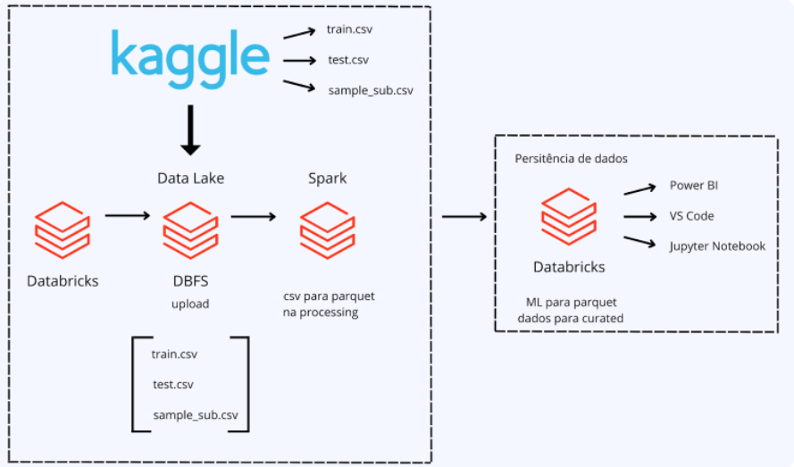

# Stack labs Docker 🐋

Projeto realizado durante a segunda edição do stack labs, nessa edição o desafio propostos foi um sistema de classificação de clientes que podem se interessar por seguros de veículos. 

Para a realização do projeto, o squad foi dividido da seguinte forma:

  
    
  &emsp;&emsp;
  &emsp; 
  

  
    
  &emsp;&emsp;
  &emsp; 
  

  
    
  &emsp;&emsp;
  &emsp; 
  

## 🚀 Começando

Para o projeto, foi escolhido as seguintes ferramentas:
- Plataforma: Databricks 📊
- Data lake: DBFS 💾
- Linguagem: Spark e python ⚙
- Dashboard : Power BI 📈
- Deploy: Streamlit 😁

 A fonte de dados utilizada, foi fornecida pelo Kaggle no link: https://www.kaggle.com/datasets/anmolkumar/health-insurance-cross-sell-prediction

## 🏰 Arquitetura do projeto

  

